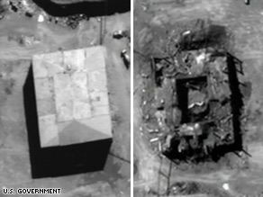
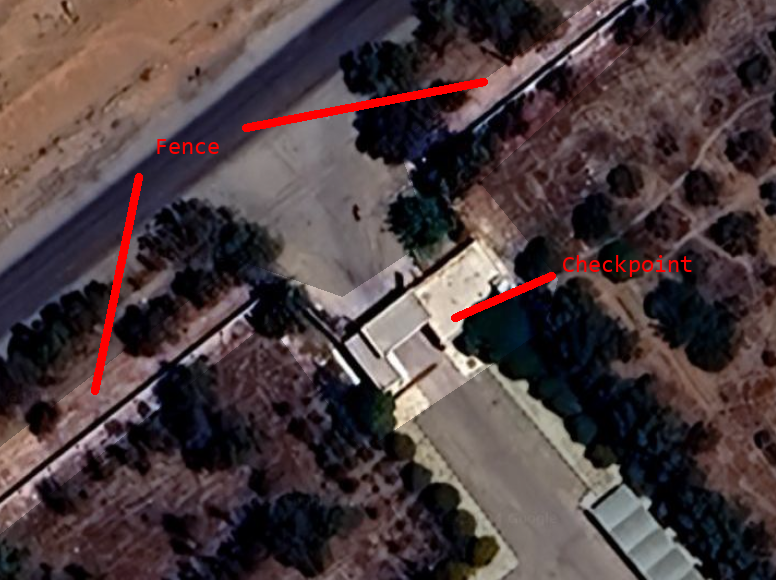
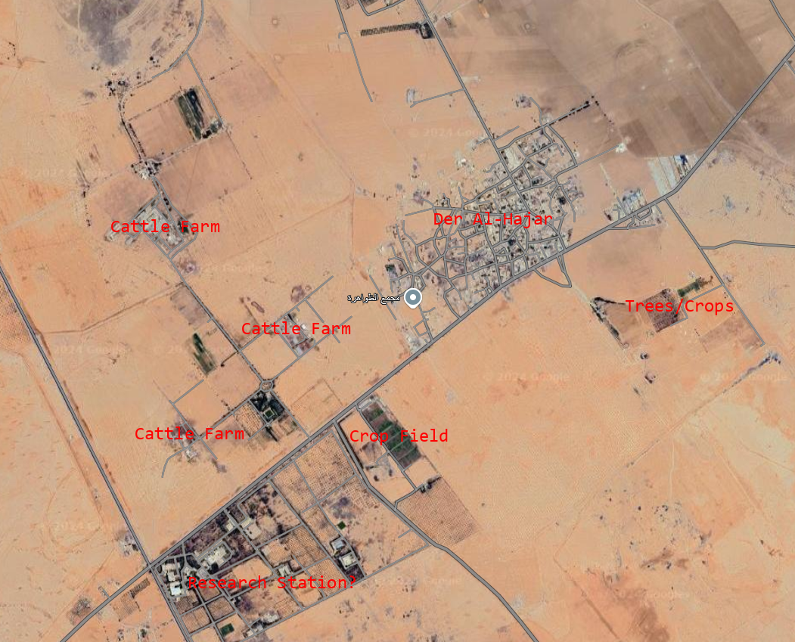

### South Africa 

#### Safari-1
https://maps.app.goo.gl/fEJGPYaSsR4MkAEd7
25°47'52.8"S 27°55'11.2"E

googling safari-1 south africa led me to this website https://www.ntp.co.za/history/ and a few images, one of which was an image titled "SAFARI-1 core arriving at the reactor building"

this suggests that this building depicted is the reactor building.
so where is this building?
wikipedia says it's at "25°48'03.0"S 27°56'54.0"E" but that's wrong.
it's about a kilometer west of that location. we locate it by looking around on google maps for the "iconic" tower. this image from wikipedia also helped to confirm location.

this [youtube video](https://youtu.be/iGeXeC3DeOk) about the reactor by the south african government also shows the inside of the reactor building. it shows at least 3 floors, and possibly more.

This rules out the building on the left or behind it as they are only one or two stories tall. 
We also have this [reddit post](https://www.reddit.com/r/brutalism/comments/s64l3q/safari1_nuclear_reactor_building_1965_pelindaba/) which has a number of images, one of which is an architect's depiction of the pretoria site.

This "site plan" has a reactor label just underneath our suspect building, practically confirming that that is in fact what we are looking for.

### South Korea

#### AGN-201K
https://maps.app.goo.gl/ddH44nhMdswmjkMa7

I find this website https://rrec.khu.ac.kr/english/center/sub_01.html?PSI=undefined
"Directions From Incheon International Airport to Kyung Hee University Global Campus"

I go back to, choosing global campus this time https://www.khu.ac.kr/eng/user/contents/view.do?menuNo=300050

The little building under the red pin seems to be the "Reactor Room"
Seems small? Let's try to confirm or deny by pictures.

All these images seem to depict small rooms. The bottom one in particular notes just two: a lecture room and a control room.

and that is exactly what we see on google maps, thus making it likely that this is in fact the reactor. the entrance is at the bottom of the above image, so it is likely that the top square portion is the reactor, as it wouldn't make sense to walk through a reactor to get to a lecture room, but the reverse seems reasonable.

#### HANARO
https://maps.app.goo.gl/bKY3FwQDTF2g8gDu7

from https://www.kaeri.re.kr/board?menuId=MENU01104
I locate this place on google maps by looking for the big red and white column. this is then cross-referenced with other things such as building elevation and small awnings/buildings on the side.

this [article](https://en.yna.co.kr/view/AEN20181114009700320) also confirms the building via the image titled "The High-flux Advanced Neutron Application Reactor (HANARO) at the Korea Atomic Energy Research Institute (KAERI) in the central city of Daejeon (Yonhap)"

The inside supposedly looks like this

We can see at least five floors.
It thus seems likely that the large grey-roofed building is the reactor building, as none others appear tall enough.

### Switzerland

#### CROCUS
https://maps.app.goo.gl/ehc9WTFxhB3PYPeQ6
This was a bitch to find.
I spent over an hour combing through different sources, guessing things. I even installed the university's app in hopes that it would help me.
Eventually I found [this page](https://www.epfl.ch/labs/lrs/facilities/) which showed two labs on floor zero of the physics department, that had staircases.
This lined up with another image I found earlier

This reactor looks to be on a raised platform.
On a hunch, I googled crocus ph l0 525 (one of the rooms that had staircases) and was given this page as the top result https://www.epfl.ch/labs/lrs/page-55656-en-html/page-55657-en-html/
It says, "Lab experiments TP2 & TP3 take place at the CROCUS reactor hall (PH L0 525)"
This is confirmation enough for me, that this platform on floor zero in that building has the reactor.

### Syria

#### SRR-1 (Unknown)

IAEA claims that [The SRR-1 is located at Deir El-Hajjar (25 km southeast of Damascus)](https://www.iaea.org/sites/default/files/23/11/syria_national_report_cns_8th_and_9th_review_meeting.pdf) 
On [this site](https://www.globalsecurity.org/wmd/world/syria/nuke2.htm) a naming clarification is made: "Dayr Al Hajar (Der Al-Hadjar)"
[This site](https://www.nti.org/education-center/facilities/srr-1/) also notes other spellings: Der Al-Hajar, Dayr Al Hajar, Dayr Al-Jajar, and Deir el-Hajjar
OpenStreetMap has a [node](https://www.openstreetmap.org/node/566713939/) called Dayr al Hajar in an appropriate place.
[Historically](https://en.wikipedia.org/wiki/Operation_Outside_the_Box) Syria's nuclear reactors have been quite non-descript.

I have thoroughly scoured the area for any potential reactor buildings, but there is simply no way to know without information beyond (repeated ad nauseum in all search results):
- Syria has a 30KW reactor it purchased from China
- That reactor is under IAEA safeguards

My best guess is [this complex](https://maps.app.goo.gl/xpdbkZkrKC3g5kpE9) at 33.337540, 36.433921.

On top of a suspicious entry checkpoint and fence in what is otherwise an agrarian part of rural Damascus the site has a large number of buildings and facilities, and at least 13 visible staff vehicles.

It is also 33km south east from Damascus, which is mentioned in [this](https://doi.org/10.1080/00288233.2001.9513472) paper:

>"Der Al-Hajar Animal Production Research Station, 33 km south-east of Damascus."

This "animal production research station" *might* be this facility, which could also host the research reactor. It seems a little farfetched I do admit, but this is as much as I can do in one evening of research.